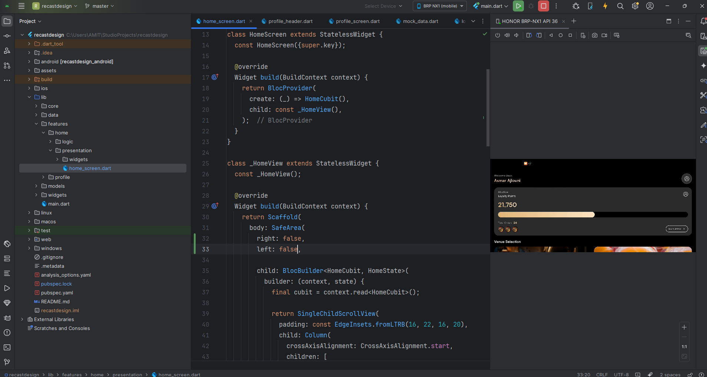
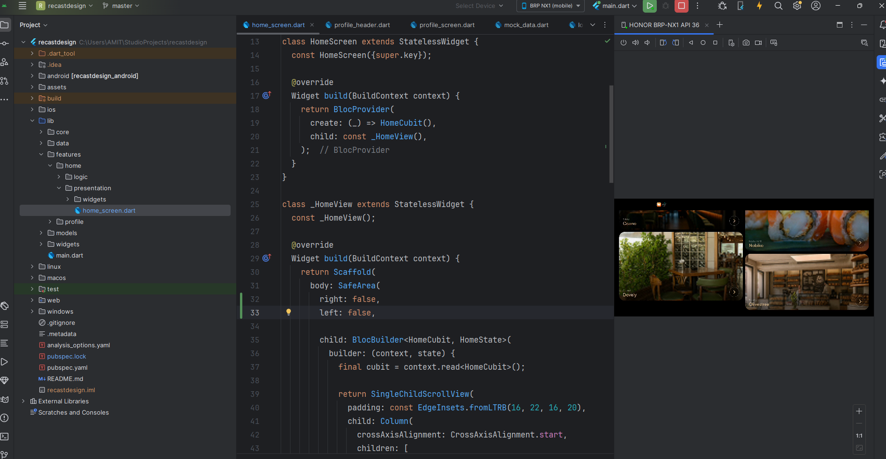
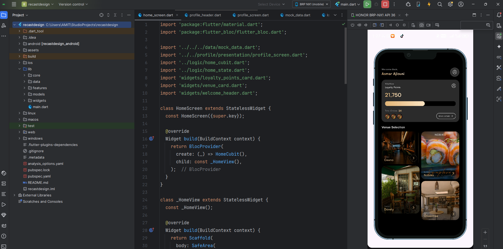
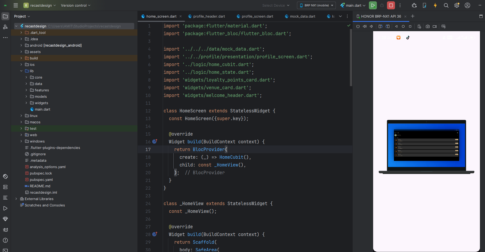
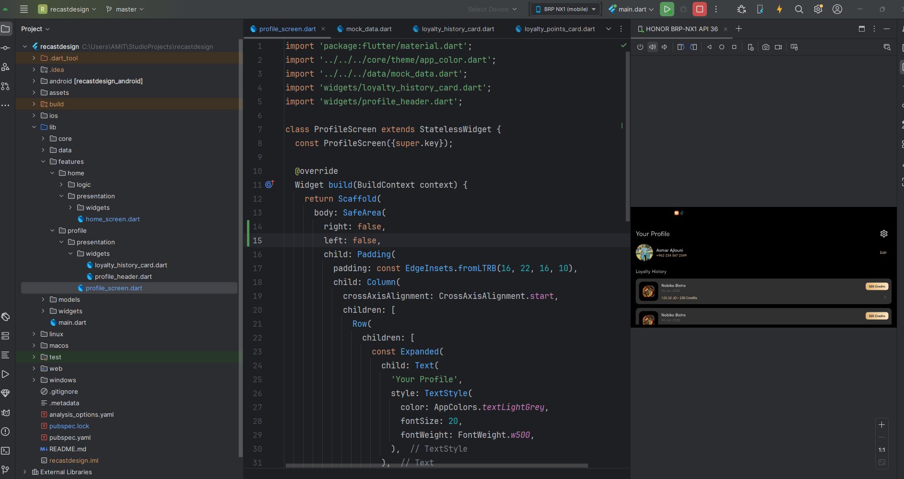

# Recast Design Flutter Assessment

This project is a Flutter implementation of a mobile UI based on the provided Figma design as part of the technical assessment process.

## Overview

The goal of this project is to recreate the given design with clean, maintainable Flutter code while demonstrating:

- Structured widget hierarchy
- Dynamic UI rendering using local mock data
- State management using Cubit
- Clear separation of concerns
- Responsive layout practices
## App Screenshots

<p align="center">
  
  
  
</p>

<p align="center">
  
  
  
</p>

<p align="center">
  
  
</p>
## Project Structure

```bash
lib/
├── core/
├── data/
├── models/
├── features/
│   ├── home/
│   └── profile/
└── widgets/


